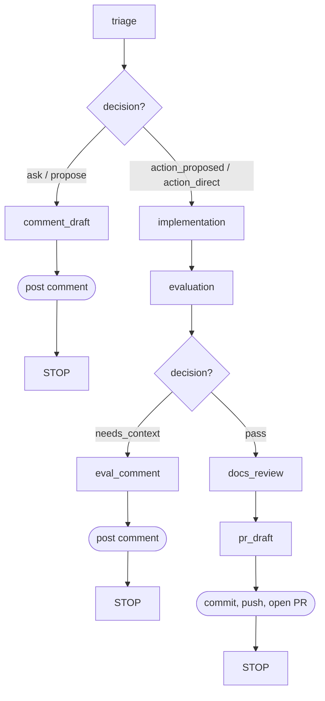

# gaas-bot

Maintenance automation for GaaS. Resolves GitHub issues, audits documentation, identifies refactoring opportunities, and checks test coverage -- all via Claude Code agents with programmatic GitHub API calls.

gaas-bot is a dev dependency of the main GaaS project. It's not part of the production runtime.

## Setup

```bash
# From the GaaS repo root
uv sync

# Copy and fill in GitHub App credentials
cp gaas-bot/example.env gaas-bot/.env
```

The GitHub App needs issue read/write and PR create permissions. See `example.env` for the required variables.

## Usage

```bash
gaas-bot resolve --issue 25
gaas-bot audit docs --dry-run
gaas-bot audit refactor --dry-run --limit 5
gaas-bot audit tests
```

If your venv isn't activated (e.g. no direnv), prefix with `uv run`.

### Commands

**`gaas-bot resolve --issue N`** -- Resolve a GitHub issue using a multi-stage Claude agent pipeline. Triages the issue, implements a fix in a git worktree, evaluates the result, updates docs, and opens a PR. All git and GitHub operations are programmatic -- Claude never runs git commands or calls the GitHub API directly.

**`gaas-bot audit docs`** -- Check documentation for drift from the codebase. Claude explores the code and returns structured findings, which are filed as GitHub issues.

**`gaas-bot audit refactor`** -- Run static analysis tools (mypy, complexipy, radon, vulture, ruff, bandit), then have Claude identify refactoring opportunities using the tool output as signal.

**`gaas-bot audit tests`** -- Audit test coverage against risk. Checks whether test rigor is proportional to irreversibility, as the project claims.

### Common options

| Flag | Default | Description |
|---|---|---|
| `--owner` | `gregology` | Repository owner |
| `--repo` | `GaaS` | Repository name |
| `--dry-run` | off | Preview findings without creating issues |
| `--limit` | `3` | Max number of findings (audit commands only) |

## Resolve pipeline

The resolve command runs a declarative pipeline of Claude agent stages. Each stage has a Jinja prompt template, a session strategy, an optional structured output model, and a routing function that picks the next stage.



### Stages

| Stage | Session | Output | What it does |
|---|---|---|---|
| `triage` | new | `TriageResult` | Reads the issue, explores the codebase, picks a path |
| `comment_draft` | resume:triage | `CommentResult` | Drafts clarifying questions or a solution proposal |
| `implementation` | new | -- | Implements the code changes in a worktree |
| `evaluation` | new | `EvalResult` | Reviews the diff, decides pass or needs_context |
| `eval_comment` | resume:evaluation | `CommentResult` | Drafts a comment explaining what context is missing |
| `docs_review` | resume:implementation | -- | Updates docs and DECISIONS.md if warranted |
| `pr_draft` | resume:implementation | `PRResult` | Crafts commit message, branch name, and PR body |

### Session strategies

- **new** -- fresh Claude session. No prior conversation context.
- **resume:\<stage\>** -- continues the named stage's session. Claude has full memory of that conversation. Used so `docs_review` and `pr_draft` remember what `implementation` built, and `eval_comment` remembers what `evaluation` found.
- **fork:\<stage\>** -- branches from the named session without mutating it. Supported but not currently used.

## Audit pipeline

Audit commands follow a simpler pattern:

1. Create a detached worktree from `origin/main`
2. Run a Claude agent with read-only tools and `output_model=AuditReport`
3. Validate the structured output (list of findings with title, body, labels)
4. Create GitHub issues programmatically (or print them with `--dry-run`)

Claude never creates issues directly. The agent returns structured data, and deterministic Python code does the GitHub API calls. Labels are constrained to a canonical set defined in `_labels.md.j2`.

## Adding a new audit type

1. Create `src/gaas_bot/templates/audit_<name>.md.j2` -- include `` and ``, use `{{ max_findings }}` for the limit
2. Add a Click subcommand in `src/gaas_bot/commands/audit.py` that calls `run_audit()` with the template name
3. That's it. The structured output model (`AuditReport`) and issue creation logic are shared.

## Adding a new resolve stage

1. Create `src/gaas_bot/templates/resolve_<name>.md.j2` -- receives the full pipeline context dict
2. Add a `Stage` entry to the `STAGES` dict in `src/gaas_bot/commands/resolve.py`
3. Wire the routing -- update an existing stage's `route` to point to the new stage

## Project structure

```
gaas-bot/
  pyproject.toml
  example.env
  DECISIONS.md
  src/gaas_bot/
    cli.py                  # Click group: resolve, audit
    commands/
      resolve.py            # Issue resolution pipeline
      audit.py              # Audit subcommands (docs, refactor, tests)
    core/
      agent.py              # Claude agent runner
      git.py                # Worktree, diff, commit/push
      github.py             # GitHub App auth + API helpers
      templates.py          # Jinja2 rendering
    models/
      resolve.py            # TriageResult, EvalResult, PRResult, CommentResult
      audit.py              # AuditFinding, AuditReport
    templates/
      _personality.md.j2    # Writing style rules (included in all user-facing prompts)
      _labels.md.j2         # Canonical label set (included in all audit prompts)
      resolve_*.md.j2       # Resolve pipeline stage prompts
      audit_*.md.j2         # Audit prompts
  tests/
    test_cli.py
    test_models.py
    test_templates.py
    test_audit.py
```

## Dependencies

- `click` -- CLI framework
- `claude-agent-sdk` -- runs Claude Code sessions programmatically
- `githubkit[auth-app]` -- GitHub API client with App authentication
- `jinja2` -- prompt templates
- `pydantic` -- structured output models
- `python-dotenv` -- loads `.env` file
